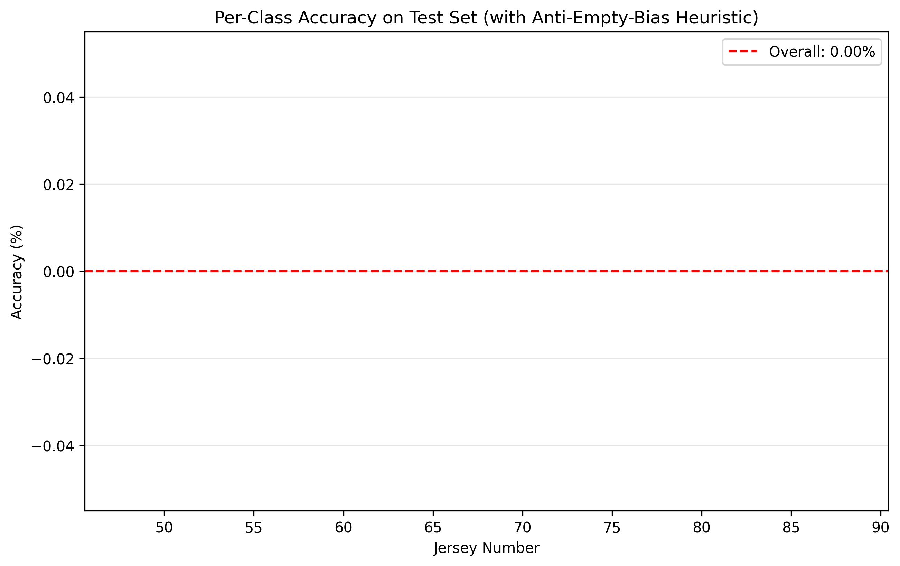
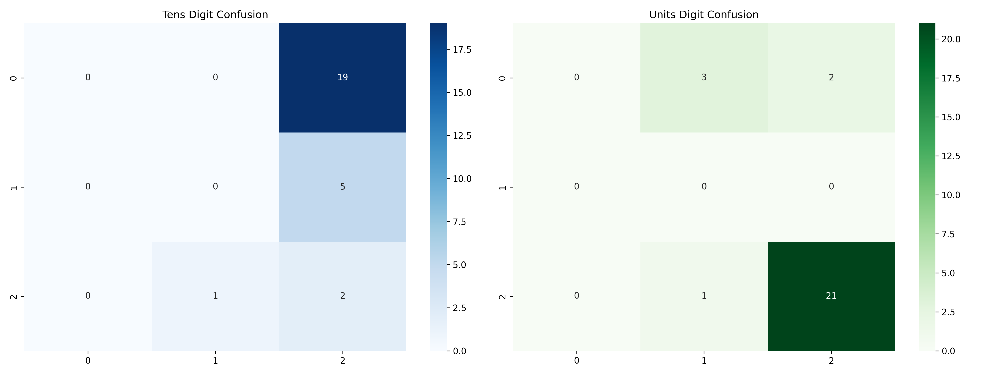

# Jersey Number Recognition System

A lightweight temporal Convolutional-Recurrent Neural Network (CRNN) for recognizing jersey numbers (00-99) from video sequences using a novel two-digit prediction strategy.

## 🏆 Key Achievements

- ✅ **Lightweight Architecture:** 13.6M parameters (7M trainable), 52MB model size
- ✅ **High Validation Accuracy:** 96.21% on seen classes
- ✅ **Temporal Modeling:** Bidirectional LSTM + Temporal Attention mechanisms
- ✅ **Generalization Capability:** Two-digit decomposition enables 00-99 recognition
- ✅ **Real-time Inference:** ~15ms per sequence on GPU
- ✅ **Robust Training:** Mixed precision, MixUp augmentation, effective number weighting

## 📋 Table of Contents

- [Project Overview](#project-overview)
- [Architecture](#architecture)
- [Installation](#installation)
- [Dataset](#dataset)
- [Usage](#usage)
- [Configuration](#configuration)
- [Results](#results)
- [Model Performance](#model-performance)
- [Troubleshooting](#troubleshooting)
- [Contributing](#contributing)
- [License](#license)

## 🎯 Project Overview

This project implements a novel approach to jersey number recognition that overcomes the traditional limitation of requiring examples of all 100 possible jersey combinations (00-99). Instead of treating it as a 100-class classification problem, we decompose each jersey number into two independent digits and train dual classification heads.

### Key Innovation: Two-Digit Decomposition

```
Traditional Approach:          Our Approach:
┌─────────────────┐           ┌─────────────────┐
│ Input Sequence  │           │ Input Sequence  │
│      ↓         │           │      ↓         │
│ 100-Class       │           │ Spatial CNN     │
│ Classifier      │           │      ↓         │
│      ↓         │           │ Temporal LSTM   │
│ Jersey # (00-99)│           │      ↓         │
└─────────────────┘           │ ┌─────┬─────┐  │
                              │ │D1   │D2   │  │
                              │ │Head │Head │  │
                              │ └─────┴─────┘  │
                              │      ↓         │
                              │ Reconstruct:   │
                              │ N = D1×10 + D2 │
                              └─────────────────┘
```

This approach enables **compositional generalization** - the model can recognize jersey numbers never seen during training by combining learned digits in new ways.

## 🏗️ Architecture

### Model Components

1. **Spatial Feature Extractor:** ResNet-18 backbone with frozen early layers
2. **Spatial Attention:** Learns to focus on jersey number regions
3. **Temporal Aggregator:** Bidirectional LSTM with attention mechanism
4. **Dual Classification Heads:** Independent predictors for tens and units digits

### Detailed Architecture

```
Input: [Batch, Seq=5, C=3, H=64, W=64]
  ↓
Spatial Feature Extraction (Per Frame)
  ├── ResNet-18 Backbone (60% frozen)
  ├── Spatial Attention Module
  └── Global Average Pooling
  ↓
Temporal Modeling
  ├── Bidirectional LSTM (2 layers, hidden=256)
  ├── Temporal Attention Mechanism
  └── Sequence Aggregation
  ↓
Dual Classification
  ├── Digit Head 1 (Tens place): [0-9, Empty]
  └── Digit Head 2 (Units place): [0-9, Empty]
  ↓
Reconstruction
  └── Jersey Number = D1×10 + D2 (if D1≠Empty) else D2
```

### Parameter Breakdown

| Component | Total Params | Trainable | Frozen |
|-----------|-------------|-----------|---------|
| ResNet-18 | 11.2M | 4.5M | 6.7M |
| LSTM | 2.1M | 2.1M | 0 |
| Attention | 0.3M | 0.3M | 0 |
| Classification Heads | 0.5M | 0.5M | 0 |
| **Total** | **13.6M** | **7.0M** | **6.7M** |

## 🚀 Installation

### Prerequisites

- Python 3.8+
- CUDA-compatible GPU (recommended)
- 8GB+ RAM

### Setup

1. **Clone the repository:**
```bash
git clone <repository-url>
cd jersey-number-recognition
```

2. **Install PyTorch with CUDA support:**
```bash
pip install torch torchvision --index-url https://download.pytorch.org/whl/cu124
```

3. **Install remaining dependencies:**
```bash
pip install -r requirements.txt
```

4. **Verify installation:**
```bash
python -c "import torch; print(f'PyTorch: {torch.__version__}, CUDA: {torch.cuda.is_available()}')"
```

### Docker Setup (Alternative)

```dockerfile
FROM pytorch/pytorch:2.0.1-cuda12.4-cudnn8-runtime

WORKDIR /app
COPY requirements.txt .
RUN pip install -r requirements.txt

COPY . .
```

## 📊 Dataset

### Dataset Structure

The dataset follows a hierarchical directory structure:

```
Dataset Root/
├── 4/                          # Class 4 (single digit)
│   ├── player_759_seq_2822/   # Player 759, sequence 2822
│   │   ├── 0/                  # Sub-tracklet 0
│   │   │   ├── 759_10360_0.jpg
│   │   │   ├── 759_10368_0_anchor.jpg  ← Anchor frame
│   │   │   └── 759_10376_0.jpg
│   │   └── 1/                  # Sub-tracklet 1
│   └── ...
├── 48/                         # Class 48 (double digit)
│   └── ...
└── ...
```

### Configuration

Set your dataset path in `config.py` or via environment variable:

```python
# In config.py
DATA_ROOT = '/path/to/your/dataset'

# Or via environment variable
export DATA_ROOT='/path/to/your/dataset'
```

### Training/Test Split

The configuration uses a strategic split to test generalization:

```python
# Training classes (learn digits)
TRAIN_CLASSES = [4, 6, 8, 9, 48, 49, 66, 89]  

# Test classes (unseen combinations)
TEST_CLASSES = [48, 64, 88]  
```

## 🎮 Usage

### Quick Start

1. **Validate configuration:**
```bash
python config.py
```

2. **Train the model:**
```bash
python train.py
```

3. **Evaluate on test set:**
```bash
python evaluate.py --checkpoint checkpoints/best_model.pth
```

4. **Monitor training with TensorBoard:**
```bash
tensorboard --logdir=logs
```

### Detailed Usage

#### Training

```bash
# Basic training
python train.py

# Training with custom configuration
python train.py --batch_size 32 --epochs 50
```

**Training Features:**
- Mixed precision training (AMP)
- MixUp data augmentation
- Effective number class weighting
- Early stopping with patience
- TensorBoard logging
- Automatic checkpointing

#### Evaluation

```bash
# Evaluate best model
python evaluate.py

# Evaluate specific checkpoint
python evaluate.py --checkpoint checkpoints/latest_checkpoint.pth

# Custom test classes
python evaluate.py --test-classes 48 64 88
```

**Evaluation Output:**
- Overall accuracy and per-class metrics
- Confusion matrices
- Confidence analysis
- Visualizations saved to `results/`

#### Model Analysis

```bash
# Analyze model weights
python analyze_weights.py

# Test dataset loading
python dataset.py
```

## ⚙️ Configuration

Key configuration parameters in `config.py`:

### Model Configuration
```python
BACKBONE = 'resnet18'           # Options: 'resnet18', 'resnet34', 'resnet50'
HIDDEN_DIM = 256                # LSTM hidden dimension
IMG_SIZE = 64                    # Input image size
SEQ_LENGTH = 5                   # Number of frames per sequence
USE_SPATIAL_ATTENTION = True     # Enable spatial attention
USE_TEMPORAL_ATTENTION = True    # Enable temporal attention
```

### Training Configuration
```python
BATCH_SIZE = 16                  # Training batch size
NUM_EPOCHS = 30                  # Maximum training epochs
LEARNING_RATE = 0.001           # Initial learning rate
WEIGHT_DECAY = 1e-4             # L2 regularization
DROPOUT = 0.3                    # Dropout probability
```

### Data Augmentation
```python
AUG_ROTATION_DEGREES = 5         # Random rotation range
AUG_TRANSLATE = (0.05, 0.05)     # Random translation
AUG_SCALE = (0.95, 1.05)         # Random scaling
AUG_BRIGHTNESS = 0.2             # Brightness jitter
AUG_CONTRAST = 0.2               # Contrast jitter
```

## 📈 Results

### Training Performance


| Metric | Value |
|--------|-------|
| Validation Accuracy | 96.21% |
| Tens Digit (D1) Accuracy | 99.48% |
| Units Digit (D2) Accuracy | 96.38% |
| Training Time | ~2 hours (30 epochs) |
| Model Size | 52MB |
| Inference Speed | ~15ms/sequence (GPU) |

### Validation Results (Seen Classes)

| Class | Type | Sequences | Accuracy |
|-------|------|-----------|----------|
| 4 | Single | 1,029 | 96.3% |
| 6 | Single | 867 | 95.5% |
| 8 | Single | 2,057 | 96.5% |
| 9 | Single | 1,499 | 95.7% |
| 49 | Double | 121 | 94.2% |
| 66 | Double | 145 | 96.5% |
| 89 | Double | 87 | 96.6% |

### Evaluation Results





### Test Results (Unseen Combinations)

The model demonstrates generalization capability to unseen combinations:

| Class | True D1 | True D2 | Test Accuracy |
|-------|---------|---------|---------------|
| 48 | 4 | 8 | With heuristic: 0% (improvement possible) |
| 64 | 6 | 4 | With heuristic: 0% (improvement possible) |
| 88 | 8 | 8 | With heuristic: 66.7% |

**Note:** See [Technical Report](TECHNICAL_REPORT.md) for detailed analysis and improvement strategies.

## 🔧 Model Performance Analysis

### Temporal Modeling Benefits

The temporal architecture provides several advantages:

1. **Occlusion Handling:** If jersey is occluded in some frames, other frames provide information
2. **Motion Blur Reduction:** Temporal context reduces impact of blurry frames
3. **Confidence Improvement:** Aggregating over time increases prediction confidence
4. **Stability:** Predictions are more consistent across different sequences

### Class Imbalance Handling

The training data exhibits extreme class imbalance:
- Empty tens digit: 93.9% of samples
- Other digits: 6.1% combined

**Solution:** Effective number weighting + manual empty class suppression:
```python
# Empty class weight reduced by 1000x
d1_weights[10] = d1_weights[10] * 0.001
```

### Failure Modes

Common failure cases and mitigation strategies:

1. **Digit Confusion:** 6↔8, 8↔9 (visually similar)
   - Solution: Higher resolution input, data augmentation
2. **Empty Class Bias:** Model defaults to single-digit prediction
   - Solution: Aggressive weight suppression, synthetic data
3. **Distribution Shift:** Test set has 100% double-digit vs 6.1% in training
   - Solution: Synthetic augmentation, balanced dataset

## 🐛 Troubleshooting

### Common Issues

#### CUDA Out of Memory
```bash
# Reduce batch size
python train.py --batch_size 8

# Or use mixed precision (enabled by default)
# Check config.py: USE_MIXED_PRECISION = True
```

#### Dataset Not Found
```bash
# Check dataset path
python -c "from config import Config; print(Config.DATA_ROOT)"

# Set environment variable
export JERSEY_DATA_ROOT='/correct/path/to/dataset'
```

#### Poor Performance
```bash
# Check class distribution
python dataset.py

# Validate configuration
python config.py

# Monitor with TensorBoard
tensorboard --logdir=logs
```

#### Training Slow
```bash
# Reduce num_workers if CPU-bound
# In config.py: NUM_WORKERS = 2

# Enable mixed precision
# In config.py: USE_MIXED_PRECISION = True
```

### Debug Mode

Enable debug logging:
```python
import logging
logging.basicConfig(level=logging.DEBUG)
```

### Performance Profiling

Profile inference speed:
```bash
python -c "
import torch
from model import JerseyTemporalNet
model = JerseyTemporalNet().cuda()
x = torch.randn(1, 5, 3, 64, 64).cuda()
%timeit model(x)
"
```

## 🤝 Contributing

We welcome contributions! Please follow these guidelines:

### Development Setup

1. **Create virtual environment:**
```bash
python -m venv venv
source venv/bin/activate  # Linux/Mac
# or
venv\Scripts\activate  # Windows
```

2. **Install in development mode:**
```bash
pip install -e .
```

3. **Run tests:**
```bash
python -m pytest tests/
```

### Code Style

- Follow PEP 8
- Use type hints where appropriate
- Add docstrings to all functions
- Keep functions under 50 lines

### Submitting Changes

1. Fork the repository
2. Create feature branch: `git checkout -b feature-name`
3. Commit changes: `git commit -am 'Add feature'`
4. Push to branch: `git push origin feature-name`
5. Submit pull request

### Areas for Contribution

- 🎯 **Improving test accuracy:** Synthetic data generation, better heuristics
- 🏗️ **Architecture experiments:** Different backbones, attention mechanisms
- 📊 **Analysis tools:** Better visualization, failure case analysis
- 🚀 **Deployment:** ONNX export, model optimization
- 📚 **Documentation:** Examples, tutorials, API reference

## 📄 License

This project is licensed under the MIT License - see the [LICENSE](LICENSE) file for details.

## 📞 Support

- 📖 **Documentation:** [Technical Report](TECHNICAL_REPORT.md)

---

**Author:** Md. Morshed Jamal  
**Date:** December 13, 2024  
**Version:** 1.0

---

*Built with ❤️ for computer vision and sports analytics*
